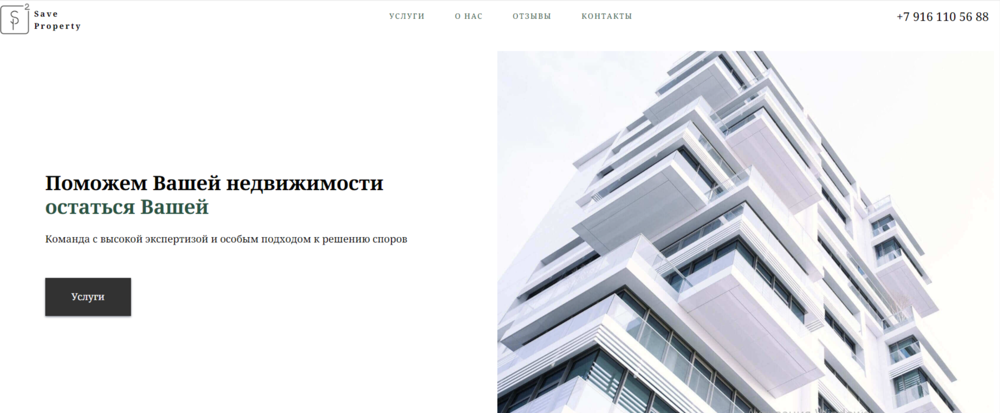
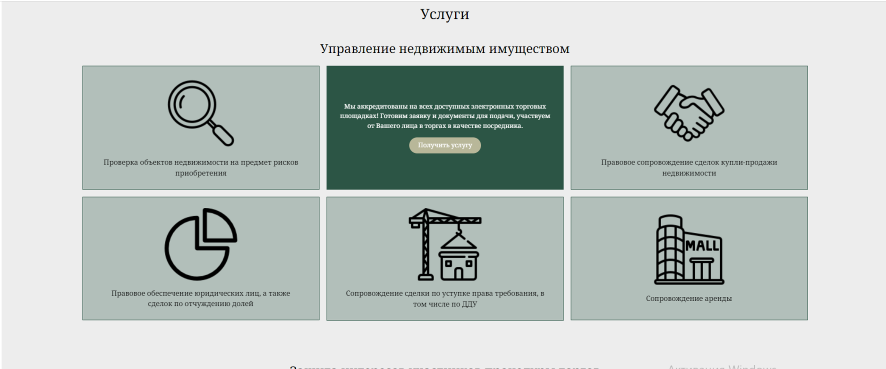

# Real estate agency website

## Functionality
This is a website priduced specially for real estate agency.  
It includes: 
 &bull; Services page  
 &bull; Company info page  
 &bull; User reviews page  
 &bull; Address page with interactive map  
 &bull; Interactive feedback form  

## Technologies used:
HTML, SCSS, BEM

## Contributors:
<h3>
  
</h3>
<h3>
  
</h3>
<h3>
  
</h3>
<h3>
  
</h3>
